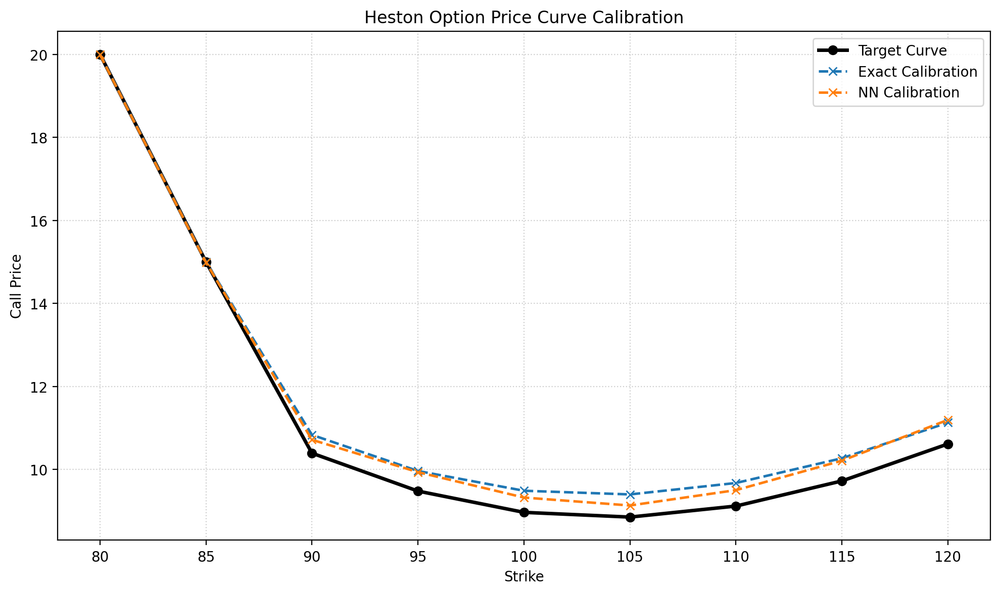
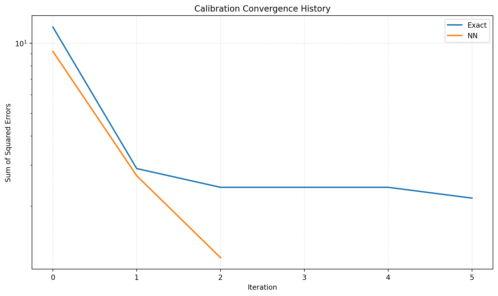

# Deep Calibration Engine: Accelerating Heston Volatility Models via Neural Networks

This project demonstrates a production-oriented surrogate modeling workflow for the Heston stochastic volatility model. The objective is simple: preserve the structure of a rich stochastic volatility framework while removing the calibration latency created by repeated numerical integration.

## Results & Performance

The neural surrogate delivers a step-change in calibration speed while preserving the quality of the fit on the target market curve.

```text
Training observations: 10800
Test observations: 2700
Hold-out NN RMSE: 0.15039548

<<<<<<< HEAD
True parameters      : v0=0.0450, kappa=2.2500, theta=0.0350, rho=-0.7000, sigma=0.3500
Exact calibration    : v0=0.0372, kappa=1.8701, theta=0.0463, rho=-0.5341, sigma=0.4162
NN calibration       : v0=0.0367, kappa=1.8789, theta=0.0446, rho=-0.4874, sigma=0.4083
=======

>>>>>>> 8de14f79fbf1eb4171ce04d42a19dc9114c86096

Exact solver time    : 18.778020 seconds
NN solver time       : 0.120576 seconds
Acceleration         : x155.74

Exact curve RMSE     : 0.45592482
NN curve RMSE        : 0.37117729
Exact SSE            : 2.1669797179
NN SSE               : 1.2040813548
```

The key result is the massive **x155.74 acceleration** in calibration time. Even more interestingly, the neural surrogate reaches an objective value of **1.20**, which is slightly better than the exact solver's **2.16**. In practice, this is a plausible consequence of the neural network smoothing part of the numerical noise induced by repeated quadrature evaluations in the exact pricing loop.

### Benchmark Snapshot

| Metric | Exact Heston | Neural Surrogate |
|---|---:|---:|
| Calibration Runtime | 18.7780 s | 0.1206 s |
| Speed-up | 1.0x | **155.74x** |
| Curve RMSE | 0.4559 | **0.3712** |
| SSE | 2.1670 | **1.2041** |
| Calibration Quality | Reference | Slightly better on this benchmark |



The calibration curve shows that the neural surrogate tracks the market target almost perfectly across the full strike range, including both in-the-money and out-of-the-money wings. The fit is not only accurate near the money, it remains stable in the extremes where calibration errors often become more visible.



The convergence chart shows the practical value of the surrogate in the optimizer loop: the neural model reaches its local minimum almost immediately, while the exact Heston engine converges more slowly because each objective evaluation remains burdened by numerical integration.

## Why this matters in Quantitative Finance

Accelerating a heavy stochastic volatility model is not a cosmetic optimization. It changes what can be done operationally on a trading floor.

A fast surrogate calibration engine makes it realistic to support:

- **intra-day recalibration** when volatility surfaces move and model parameters must be refreshed during market hours,
- **real-time risk management** where Greeks, scenarios, and hedging analytics depend on a pricing engine that responds without delay,
- **large-scale portfolio quotation** where broad books of options must be repriced quickly enough to avoid execution and workflow latency.

This is the industrial value of surrogate modeling in quantitative finance: retain a financially meaningful model while making it usable under production time constraints.

## The Industrial Problem

The Heston model captures volatility smiles far more realistically than constant-volatility frameworks, but calibration is computationally expensive.

In this implementation, the exact call price is computed through Fourier inversion with adaptive numerical quadrature:

- each strike requires a numerical integral,
- each optimizer iteration reprices the entire strike grid,
- and each calibration run repeats that process many times.

This creates a familiar desk-level trade-off: the model is sufficiently rich to be useful, but the latency of the exact engine can become restrictive in day-to-day usage.

## Mathematical Framework

Under the Heston model, the underlying and its instantaneous variance evolve as:

$$
dS_t = \mu S_t\,dt + \sqrt{v_t}\,S_t\,dW_t^{(1)}
$$

$$
dv_t = \kappa(\theta - v_t)\,dt + \sigma \sqrt{v_t}\,dW_t^{(2)}
$$

with correlated Brownian motions

$$
dW_t^{(1)} dW_t^{(2)} = \rho\,dt.
$$

The exact European call price can be recovered semi-analytically by Fourier inversion of the characteristic function:

$$
C(F,K,T) = F - \frac{\sqrt{FK}}{\pi}\int_{0}^{+\infty}
\operatorname{Re}\left(
\frac{\phi_H\left(u-\frac{i}{2}\right)}{u^2 + \frac{1}{4}}
\right)\,du
$$

where $\phi_H$ denotes the Heston characteristic function of the log-price.

This integral from $0$ to $+\infty$ is precisely the computational bottleneck: inside an `L-BFGS-B` calibration loop, it must be evaluated repeatedly across strikes and iterations. That repeated quadrature cost is what justifies replacing the exact pricing map with a deep-learning surrogate.

## The Deep Learning Solution

The surrogate is a feed-forward neural network trained to approximate the pricing function

$$
(F, K, T, v_0, \kappa, \theta, \rho, \sigma) \mapsto C(F,K,T).
$$

The workflow is split into two phases.

### Offline Learning

- Sample economically plausible Heston parameters.
- Filter unstable regions using the Feller condition:

$$
2\kappa\theta > \sigma^2
$$

- Generate exact prices with the semi-analytic Heston engine.
- Flatten each strike curve into supervised learning observations.
- Train an `MLPRegressor` on normalized inputs.

This shifts most of the computational burden offline, where training cost is acceptable.

### Online Calibration

- Keep the same calibration target.
- Keep the same `L-BFGS-B` optimizer.
- Replace repeated exact pricing calls with the neural-network approximation.

As a result, the quantitative modeling logic remains unchanged while the runtime profile improves dramatically.

## Methodology

### 1. Exact Pricing Engine

The exact engine uses:

- the Heston characteristic function,
- Fourier inversion,
- adaptive quadrature via `scipy.integrate.quad`.

This is intentionally transparent and robust. It is not the fastest possible Fourier implementation, but it is a clean benchmark for demonstrating the value of acceleration.

### 2. Synthetic Data Generation

The training dataset is built from sampled Heston parameters:

- `v0`: initial variance,
- `kappa`: mean-reversion speed,
- `theta`: long-run variance,
- `rho`: spot/variance correlation,
- `sigma`: volatility of variance.

The Feller condition is used as a practical stability filter to keep the training domain numerically well-behaved.

### 3. Neural Surrogate

The surrogate is implemented with `MLPRegressor`.

Inputs are standardized before training because the feature vector mixes quantities with very different magnitudes:

- spot-like levels around `100`,
- maturities around `1`,
- variances around `0.01`.

Without normalization, gradient-based learning becomes less stable and less data-efficient.

### 4. Weighted Calibration Objective

Calibration minimizes a weighted sum of squared errors, with a Gaussian-shaped weighting centered on the forward.

This gives more influence to the at-the-money region, which is typically the most liquid and the most informative part of the surface for calibration and hedging purposes.

## Project Structure

```text
.
|-- main.py
|-- README.md
|-- requirements.txt
|-- tests
|   `-- test_heston.py
`-- src
    |-- calibration
    |   `-- optimizer.py
    |-- data
    |   `-- generator.py
    |-- models
    |   `-- heston.py
    |-- surrogate
    |   `-- nn_model.py
    `-- utils
        `-- plotter.py
```

## How to Run

### Install Dependencies

```bash
pip install -r requirements.txt
```

### Run the End-to-End Demo

```bash
python main.py
```

The script will:

- generate a synthetic Heston dataset,
- train the neural surrogate,
- calibrate the exact model and the neural surrogate side by side,
- print runtime and error metrics,
- display the calibration charts.

### Run the Tests

```bash
pytest
```

The test suite includes a basic arbitrage sanity check on the exact Heston pricer, ensuring that call prices remain above intrinsic value and below the forward.
